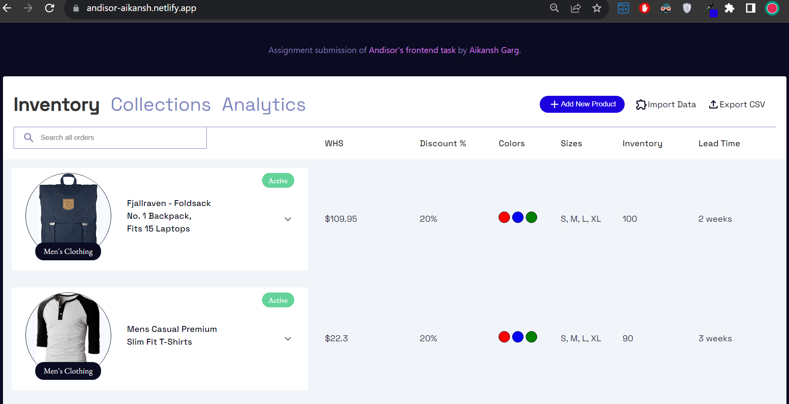
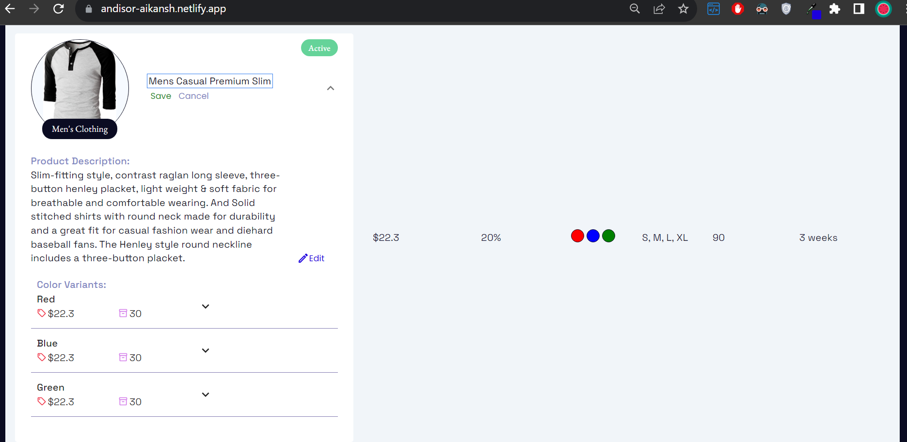

React E-Commerce Website - Andisor
This React e-commerce website project aims to create a user-friendly inventory page with advanced features such as inline editing, hierarchical display of product variants, and persistent data storage between sessions. The website follows Andisor's brand colors and design principles, providing a seamless user experience.

### Hierarchical Display:

Main products are listed initially.
Expanding a product reveals primary variants.
Further expansion displays secondary variants.

### Inline Editing:

Users can edit any field at any level inline.
Changes are saved instantly.

### Persistent Data:

Edited information is stored in the browser session.
Refreshing the page does not result in data loss.

### Andisor Branding:

The website is designed with Andisor's brand colors and palette.
Thematic styling enhances the overall brand experience.

### Technologies Used

React.js
Material-UI for UI components
Mock API for server (using the free API editor)

### Project Structure

#### Components:

EditableField: Handles inline editing functionality.
Navbar: Navigation bar component.
ProductList: Main inventory page component.

#### Services:

api.js: Interface for fetching products from the Mock API.

#### Styles:

Navbar.css: Styles for the navigation bar.
Other CSS files: Additional styles for components.

### Usage

Clone the repository.
Install dependencies using npm install.
Start the development server with npm start.

### Design Principles

#### Brand Consistency:

The website follows Andisor's brand colors and palette.
Consistent thematic styling enhances the brand identity.

#### User-Friendly Interface:

Hierarchical product display simplifies navigation.
Inline editing provides a seamless editing experience.

#### Improvements and Innovations

Accessibility: Implement accessibility features for a wider user audience.
Search Functionality: Add a functional search bar for easier product navigation.
Sort by Columns: Add sort feature based on different column values
Image Optimization: Optimize product images for faster loading.
